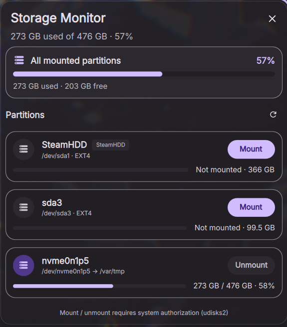

# Storage Monitor for DankMaterialShell

A DankBar widget that shows total storage usage and lists every mountable partition — internal NVMe/SATA drives and removable media alike — with mount, unmount, and safe-removal actions powered by [udisks2](https://www.freedesktop.org/wiki/Software/udisks/).



## Features

- Total used / total size / free space summary with a usage bar
- Per-partition usage: used, total, free, and percentage
- All mountable partitions, including internal drives (not just USB)
- Mount and unmount right from the popout
- Safely remove external drives by unmounting every partition, flushing caches, and powering off the parent drive
- Click-to-confirm unmount and safe-removal actions to prevent accidents
- Volume labels shown when available
- Automatic refresh (15s to 5 minutes)
- Works with ext4, btrfs, xfs, ntfs, exfat, vfat and more

## Requirements

- DankMaterialShell 1.2 or newer
- Wayland
- `udisks2` with a polkit authentication agent (e.g. `hyprpolkitagent`, `polkit-kde-agent`)

On Arch/CachyOS:

```bash
sudo pacman -S udisks2 polkit
```

## Installation

```bash
mkdir -p ~/.config/DankMaterialShell/plugins
cd ~/.config/DankMaterialShell/plugins
git clone https://github.com/smithyyang/dms-storage-monitor.git storageMonitor
dms restart
```

Then enable **Storage Monitor** from DMS Settings → Plugins and add it to DankBar.

## Usage

1. Click the storage icon in DankBar to open the popout.
2. Each partition card shows the mount point, file system, and usage.
3. Click **Mount** on an unmounted partition to mount it.
4. Click **Unmount** to unmount only that partition — click **Confirm?** within 3 seconds to proceed.
5. For USB/removable drives, click the eject button and confirm to unmount all partitions on the physical drive and run `udisksctl power-off`. Wait for the success message before unplugging it.

## Notes

- Storage actions use `udisksctl`, which shows a standard system authorization prompt through polkit.
- **Unmount** detaches a filesystem but may leave a mechanical drive spinning. The eject button performs safe removal and tells you when the drive can be unplugged.
- Some file systems (e.g. NTFS) may need extra packages (`ntfs-3g`) for write access.
- Swap, loop, and virtual file systems (tmpfs/overlay) are hidden.

## License

MIT — see [LICENSE](LICENSE).
